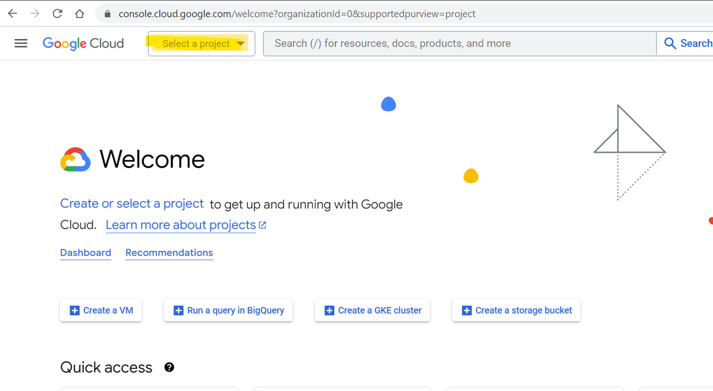
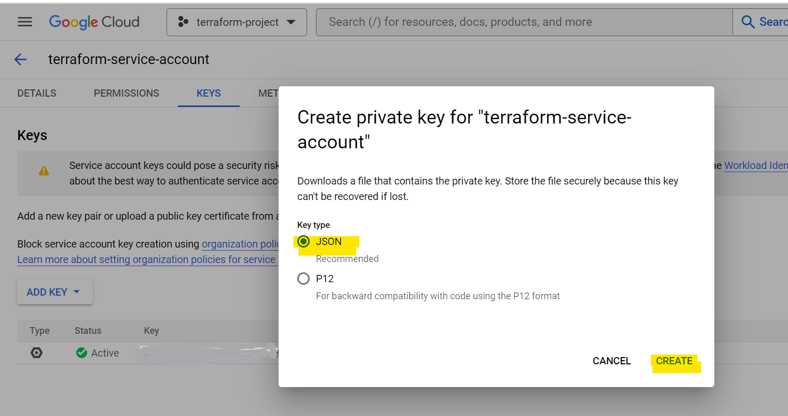
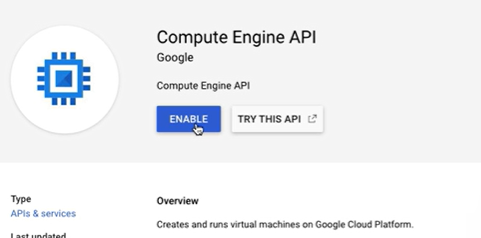

# Deploy with Terraform in Google Cloud Platform (GCP)

Set up a Terraform project that enables the deployment of resources on Google Cloud Platform (GCP). This project setup also a remote Terraform state file stored in a bucket created on GCP.

There are two main sections, the first one explain how to setup the necessary resources in GCP and the second one will for the terraform code and the deploy part. 

## Setup in GCP
### 1.  Account creation

Create a free account on [GCP](https://console.cloud.google.com/), take advantage of the free credit provided for a limited time. However, please note that after the trial period, you will be automatically charged. To avoid any unexpected charges, it's recommended to set up an alert from the first day of usage, so you will be notified when you exced the limit in your alarm.


### 2. Create New Project   
Once you have your account, go to the [GCP portal](https://console.cloud.google.com/) and create a new project: 

- Select a Project / New Project / create




### 3.  Create a service account: 
- Hamburger menu / IAM & Admin / Service Account / + Create Service Account
  
 - Choose a name,
  
  
 - Grant this service account access to project
    -  in the menu "By product or service" scroll down and  choose "Project" and give it the "Editor" role.
    
  
- Grant users access to this service account. 
  
  Put the user email that you want to grant the permission to administer this service account.
 
  
- Done 
  
  You've created the Service account, now you need to create your api key to allow connection. 
- API Key creation

  Go to you service account / Keys / ADD KEYS / Create new key / JSON / Create
   
   
   

  It will download the key. Put in a file in your pc.   
    
  
 

### 4. Enable API 
You need to enable some API, for that go to :
- Hamburger menu / APIs & Services / Enabled APIs & services / + ENABLE APIS & SERVICES 


- On the search bar, search for this 3 API, and eanble them if not alredy anabled.

  - Cloud Storage
  - Compute Engie API  
  - Cloud resource manager API 

  
  
  

### 5. Bucket Creation

To Create a bucket in google cloud console go to: 

- Hamburger menu / Cloud Storage / Buckets / + Create / Name your bucket (unique name) / Continue/ choose the option that you want / Create 


- Go to your bucket and creata folder inside (tab Create Folder), name ir and create. 


Congratulations, all the necessary setup in GCP is done, now will will continue with the Terraform code section. 

## Terraform code 

### 1. Terraform install 
 
 The ojective of this tutorial is not to learn how to install terraform, but nevertheless you need to have terraform in your pc. You can fallow the steps in this [link](https://developer.hashicorp.com/terraform/tutorials/aws-get-started/install-cli) to install it if not already done.  


### 2. Get the code 
Once you are in your favorite editor you will find two files "main.tf" and "vpc.tf".  

- The "main.tf"
 
  In this file you will find the terraform code that allows to install the provider and connect to GCP, but for that you need to edit it. 

  You need to edit the main.tf, put the correct path where you api is in your pc. In my case is this. 

  ```bash
  credentials = file("C:/alba/.google/gcp-key.json")
  ```
  you need also to modify the project name, in my case is this.

  ```bash
  project = "terraform-project-88888"
  ```

  region and zone you can also change but as it is, it will work.

  For the backend block, you need to put your bucket name, in my case is  "terraform-bucket-alba", the prefix is the folder  name inside the bucket, in my case is "terraform-1". The credentials is the path to your API key, is the same as before.

  ```bash
  backend "gcs" {
      bucket = "terraform-bucket-alba"
      prefix = "terraform-1"
      credentials = "C:/Users/alba/.google/gcp-key.json"
    }

  ```

- The "vpc.tf"
  
  In this file is the code to deploy a google compute network resource in GCP you can find the documentation [here](https://registry.terraform.io/providers/hashicorp/google/latest/docs/resources/compute_network). Don't need modifications. 

### 3. Deploy 
 Now you can deploy using terraform. Go to the terminal, go inside the folder with the terraform code, and run 

 ```bash
 terraform init
 ```


 after that, run 

  ```bash
 terraform plan
 ```
 you will see the resource to be created, at this time is only an overviw, no resources has been create yet. 

 

  ```bash
 terraform apply
 ```

 you need to confirm mannually or otherwise you can run 

 ```bash
 terraform apply -auto-approve
 ```

 and now the resources has been crete. 

 
 

 It is important to note that using the "-auto-approve" flag can be risky, as it bypasses the confirmation step and can result in unintended changes to the infrastructure. Therefore, it is recommended to use this flag with caution and only when you are certain that the changes are safe to apply.


 ## Congratulations

 You have deploy resources in GCP via terraform code (IaC), you can now go to the console and see the resources that has been created and also see the terraform.tfstate file in the folder inside the bucket. 

This is the vpc that has been created 


This is the terraform.tfstate file inside the bucket


## DEstroy

If you want to destroy, the resources you can run 

```bash
 terraform destroy
 ```

 or 
 
 ```bash
 terraform destroy -auto-approve
 ```